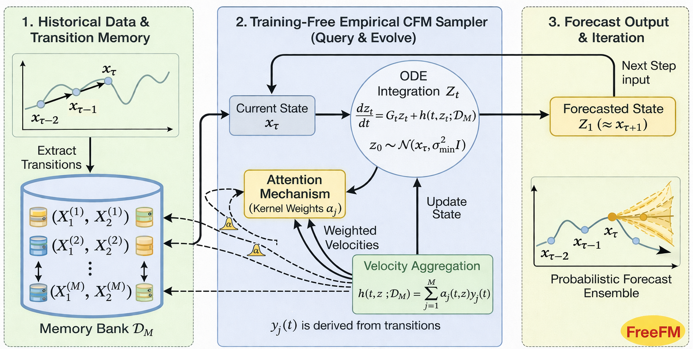

# [Is Flow Matching Just Trajectory Replay for Sequential Data?](https://arxiv.org/abs/2602.08318)

Flow matching (FM) is increasingly used in scientific domains for time series generation and forecasting, where data often arise from underlying dynamical systems. However, it
is not well-understood whether it learns transferable dynamical structure or simply performs an effective “trajectory replay”. We study this question by deriving the velocity field targeted by the empirical FM objective on sequential data in the limit of perfect function approximation. For the Gaussian conditional paths commonly used in practice, we
show that the implied sampler is an ODE whose dynamics constitutes a nonparametric, memory-augmented continuous-time dynamical system. The optimal field admits a closedform expression as a similarity-weighted mixture of instantaneous velocities induced by observed transitions, making the dataset dependence explicit and interpretable. This characterization positions neural FM models as parametric surrogates of an ideal nonparametric solution and suggests practical approximation schemes for robust ODE-based generation. As a byproduct of our analysis, the resulting closed-form sampler, FreeFM, provides strong probabilistic forecasts on nonlinear dynamical system benchmarks directly from historical transitions, without training.

This repository provides a minimal implementation of *FreeFM*, a flow matching inspired training-free model for probabilistic forecasting.
For a standalone tutorial, see this [notebook](https://colab.research.google.com/drive/1yA9_GlwIiZVtFlZjOXWbYadckxqOvPgu?usp=sharing) or this [blog post](https://dynamai.github.io/freeFMblog/). 



## **Setup and Running Examples**
First, install packages from `requirements.txt`. Then we can run the code with simple examples below.

```
python main.py --system dho --mode topk --device cuda:0 --integrator euler --ode_steps 100 --topk 64
```

```
python main.py --system lorenz63 --mode topk --device cuda:0 --integrator euler --ode_steps 100 --topk 256
```

## **Citation**
If you find our work useful for your research, please consider citing our paper:
```
@article{lim2026flow,
  title={Is Flow Matching Just Trajectory Replay for Sequential Data?},
  author={Lim, Soon Hoe and Lin, Shizheng and Mahoney, Michael W and Erichson, N Benjamin},
  journal={arXiv preprint arXiv:2602.08318},
  year={2026}
}
```
